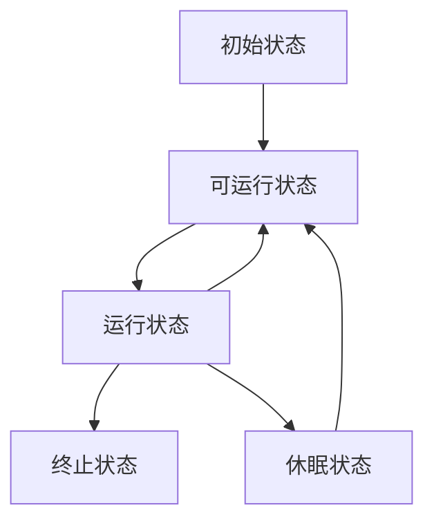

# 基础理论

## 并发问题的源头

### 可见性

### 原子性

### 有序性

## Java内存模型

## 互斥锁

### Happens-Before 原则

#### 顺序性规则

程序前面对某个变量的修改一定是对后续操作可见的

### volatile 变量规则

对一个 volatile 变量的写操作， Happens-Before 于后续对这个 volatile 变量的读操作。

### 传递性

 A Happens-Before B，且 B Happens-Before C，那么 A Happens-Before C

这条很关键，多线程很多时候都是靠这个和第二条结合来保证变量的可见性

### 管程中锁的规则

对一个锁的解锁 Happens-Before 于后续对这个锁的加锁。

### 线程 start() 规则

主线程 A 启动子线程 B 后，子线程 B 能够看到主线程在启动子线程 B 前的操作。

### 线程 join() 规则

主线程 A 等待子线程 B 完成（主线程 A 通过调用子线程 B 的 join() 方法实现），当子线程 B 完成后（主线程 A 中 join() 方法返回），主线程能够看到子线程的操作。当然所谓的“看到”，指的是对**共享变量**的操作

#### 线程中断规则

对线程interrupt()方法的调用先行发生于被中断线程的代码检测到中断事件的发生，可以通过Thread.interrupted()方法检测到是否有中断发生

#### 对象终结规则

一个对象的初始化完成(构造函数执行结束)先行发生于它的finalize()方法的开始


### 加锁的时候，得特别注意是不是保护的同一个资源

```java
class SafeCalc {
  static long value = 0L;
  // 锁住 this对象
  synchronized long get() {
    return value;
  }
  // 锁住 SafeCalc Class类
  synchronized static void addOne() {
    value += 1;
  }
}

// 加锁的对象无效，因此无用
```

### 假如想用锁保护许多资源，要注意使用同一把锁

```java
class Account {
  private int balance;
  // 转账
  void transfer(Account target, int amt){
    // Account.class 对象是唯一的
    synchronized(Account.class) {
      if (this.balance > amt) {
        this.balance -= amt;
        target.balance += amt;
      }
    }
  } 
}
```

## 死锁

### 互斥: 共享资源 X 和 Y 只能被一个线程持有

- 加锁的必然效果，不可破坏

### 占有且等待，线程 T1 已经取得共享资源 X，在等待共享资源 Y 的时候，不释放共享资源 X

- 可以一次性申请全部的资源
  - 专门使用一个单例类来分配资源，一次性分配好全部资源

### 不可抢占，其他线程不能强行抢占线程 T1 占有的资源

- 这个java的关键字干不了

### 循环等待，线程 T1 等待线程 T2 占有的资源，线程 T2 等待线程 T1 占有的资源，就是循环等待

- 可以对资源进行排序，所有人获取资源时按顺序获取，那么就不会出现死锁


## 等待-通知机制

###  使用 synchronized 和 wait() notify() notifyAll()

```java
class Allocator {
  private List<Object> als;
  // 一次性申请所有资源
  synchronized void apply(
    Object from, Object to){
    // 经典写法，当条件不满足时进入等待队列
    while(als.contains(from) ||
         als.contains(to)){
      try{
        wait();
      }catch(Exception e){
      }   
    } 
    als.add(from);
    als.add(to);  
  }
  // 归还资源
  synchronized void free(
    Object from, Object to){
    als.remove(from);
    als.remove(to);
    // 释放资源
    notifyAll();
  }
}
```

- notify() 只会随机通知一个等待区的线程，因此一般情况下使用 notifyAll() 比较好


## 管程(Monitor)

```java
public class BlockedQueue<T>{
  final Lock lock =
    new ReentrantLock();
  // 条件变量：队列不满  
  final Condition notFull =
    lock.newCondition();
  // 条件变量：队列不空  
  final Condition notEmpty =
    lock.newCondition();
 
  // 入队
  void enq(T x) {
    lock.lock();
    try {
      // 在 while循环里调用 await() 是一个编程范式
      // 因为需要再判断一次条件是否满足
      while (队列已满){
        // 等待队列不满 
        notFull.await();
      }  
      // 省略入队操作...
      // 入队后, 通知可出队
      notEmpty.signal();
    }finally {
      lock.unlock();
    }
  }
  // 出队
  void deq(){
    lock.lock();
    try {
      while (队列已空){
        // 等待队列不空
        notEmpty.await();
      }
      // 省略出队操作...
      // 出队后，通知可入队
      notFull.signal();
    }finally {
      lock.unlock();
    }  
  }
}
```

- synchronized相当于只有一个条件变量的管程


## 线程的生命周期



### 初始状态

- 线程已经被创建，但是还没分配CPU
- 编程语言层面上的概念，操作系统的线程还未创建

### 可运行状态

- 线程可以分配CPU执行
- 真正的操作系统线程已经创建

### 运行状态

- 被分配到CPU的就是运行状态了

### 休眠状态

- 调用阻塞的API时进入
- 释放CPU使用权
- 等待的事件出现后变为可运行状态

### 终止状态

- 执行完成或出现异常


### Java语言中线程的生命周期

- NEW
- RUNNABLE
- BLOCKED
- WAITING
- TIMED_WAITING
- TERMINATED

### RUNNABLE 与 BLOCKED 的状态转换

- 只有一种场景会触发这种转换，就是线程等待 synchronized 的隐式锁
- JVM 里，线程调用阻塞API时，不会进入 BLOCKED 状态

### RUNNABLE 与 WAITING 的状态转换

- 获得 synchronized 隐式锁的线程，调用无参数的 Object.wait() 
- 调用无参数的 Thread.join() 方法
  - 线程A调用 线程B.join() ，线程A进入 WAITING 
- 调用 LockSupport.park() 方法
  - 调用该方法时，当前线程会阻塞，进入WAITING状态
  - LockSupport.unpark(Thread thread) 可唤醒目标线程

### RUNNABLE 与 TIMED_WAITING 的状态转换

- 调用**带超时参数**的 Thread.sleep(long millis) 方法
- 获得 synchronized 隐式锁的线程，调用**带超时参数**的 Object.wait(long timeout) 方法
- 调用**带超时参数**的 Thread.join(long millis) 方法
- 调用**带超时参数**的 LockSupport.parkNanos(Object blocker, long deadline) 方法
- 调用**带超时参数**的 LockSupport.parkUntil(long deadline)

### 从 NEW 到 RUNNABLE 状态

- 创建 Thread 对象的时候就是NEW
- 调用 start() 方法就转换到 RUNNABLE

### 从 RUNNABLE 到 TERMINATED 状态

- run() 方法执行完或抛出异常而终止
- 假如想停止一个线程，建议使用 interrupt() 而不思 stop()

#### 如何安全的停止线程

- 可以捕获 InterruptedException 异常
- 当线程 A 处于 RUNNABLE 状态时，并且阻塞在 java.nio.channels.InterruptibleChannel 上时，如果其他线程调用线程 A 的 interrupt() 方法，线程 A 会触发 java.nio.channels.ClosedByInterruptException 这个异常；
- 阻塞在 java.nio.channels.Selector 上时，如果其他线程调用线程 A 的 interrupt() 方法，线程 A 的 java.nio.channels.Selector 会立即返回
- 可以通过 isInterrupted() 方法主动检测


